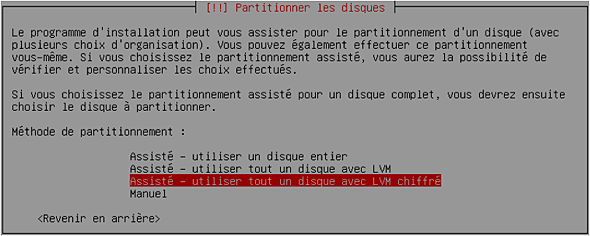

# Sécurisation à l'initialisation #

## Chiffrer le gestionnaire de volumes logiques (LVM)##

Une des toutes première sécurité à mettre en place est le chiffrement du gestionnaire de volumes logiques. Tout simplement que l'un personne malveillante obtenant la machine aura accès aux disque et donc aux données. Il est nécessaire de le faire sur un serveur même si normalement il faut un badge pour y accéder. Et surtout sur un ordinateur portable, puisqu'il est plus fréquent de l'utiliser lors de déplacement.

Lors de l'installation choisir 'Assisté - Utiliser tout un disque avec LVM chiffré' :


Puis renseigner un mot de passe. On recommande minimum 20 charactères, des majuscules, des minuscules, et des signes de ponctuations:


Enfin le programme d'installation va écrire des données aléatoires pour renforcer la qualité du chiffrement. Lors du démarrage nous aurons le mot de passe à renseigner avant de pouvoir accèder à la suite.

## Sécuriser le BIOS ##

1. Positionner un mot de passe sur le BIOS. ATTENTION, si on l'oublie alors impossible d'accèder au BIOS par la suite.

## Sécuriser le bootloader ##

Sous debian c'est GRUB le programme qui assure la fonction de bootloader. Durant le démarrage, grub va afficher un menu, et nous pouvons passer des paramètres à ce fameux programme. Ce qui rend possible certaines attaques.

L'importance est de mettre un mot de passe à GRUB pour restreindre l'édition de GRUB :

### Version de GRUB ###

Détecter la version de grub avec DPKG :
```bash
dpkg -l | grep grub
  ii  grub-common             2.02~beta3-5+deb9u1       amd64        GRand Unified Bootloader (common files)
  ii  grub-pc                 2.02~beta3-5+deb9u1       amd64        GRand Unified Bootloader, version 2 (PC/BIOS version)
  ii  grub-pc-bin             2.02~beta3-5+deb9u1       amd64        GRand Unified Bootloader, version 2 (PC/BIOS binaries)
  ii  grub2-common            2.02~beta3-5+deb9u1       amd64        GRand Unified Bootloader (common files for version 2)
```
'ii' pour le fait que c'est un paquet installé, et nous pouvons voir que les paquets on pour version 2.02.

### Mot de passe GRUB ###

Tout d'abord sauvegardons le fichier grub.cfg.
```bash
mkdir /root/grub.save/
cp /boot/grub/grub.cfg /root/grub.cfg.save/
```

Puis lancer l'utilitaire **grub_mkpassd_pbkdf2** :
```bash
grub_mkdpassd_pbkdf2
```
Rentrer un mot de passe, ce qui va ensuite générer un hash en SHA-1 basé sur 512 bit. Copier le hash dans le fichier de configuration : '/boot/grub/grub.cfg':
```bash
set superusers="neaj"
password_pbkdf2 neaj [hash]
```
